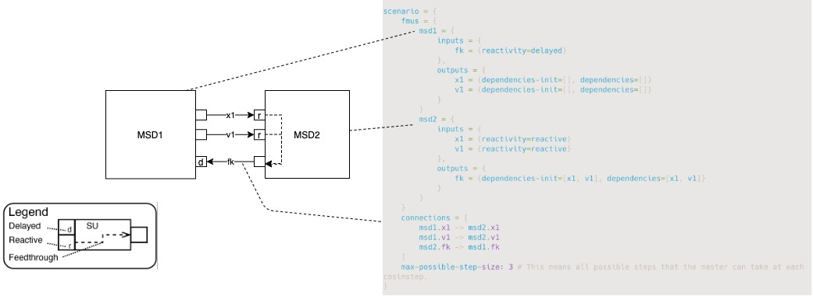

# Scenario-Verifier

This repository contains the Verifier used in the paper: "Verification of Co-Simulation Algorithms". The Verifier lets the user specify a scenario in an easy and readable way. 
The tool can parse a scenario and algorithm to verify it against an Uppaal model from the previously mentioned paper.

## The scenarios:

The scenarios are described as several simulation units, the connections, and the orchestration algorithm used to run the co-simulation.
The scenarios are divided into two folders:

* [Examples](./Scenario/examples) contains a scenario and a correct master algorithm.
* [Common_mistakes](./Scenario/common_mistakes)  contains a scenario and an incorrect master algorithm.

A graphical presentation of the different co-simulation scenarios can be found in the [Image-folder](https://github.com/SimplisticCode/Co-simulation-Verifier/tree/master/Scenario/Images).

The scenarios include, among others:

* Various versions of Algebraic Loops
* Different Step Finding Routines
* Algorithms with an adaptive step size
* Algorithms with a fixed step size

## Encode a scenario:

A co-simulation scenario should be encoded in the conf-format in order for the Verifier to parse and verify it!
The scenario includes the FMUs and connections between them.

An example of the encoding in the [conf-format](./Scenario/examples/simple_master.conf) for a scenario:


In the scenario, an initialization procedure and co-simulation step procedure are also included.

### Initialization Procedure:
The initialization procedure is a sequence of operations performed on the FMUs in the scenario during the Initialization.
The initialization procedure can include the following type of operations:

* Set a value on an FMU input port
* Get a value on an FMU output port 

An example of the initialization procedure for the scenario above:

```
initialization = [
    {get: msd1.x1}
    {set: msd2.x1}
    {get: msd1.v1}
    {set: msd2.v1}
    {get: msd2.fk}
    {set: msd1.fk}
]
```
### Co-simulation Step Procedure:
The Co-simulation Step procedure is a sequence of operations performed on the FMUs in the scenario during a co-simulation to move all FMUs from an initial time "t" to the next point in time, where FMUs should be synchronized.
The Co-simulation Step procedure can include the following type of operations:

* Set a value on an FMU input port
  * Set this set a value obtained at the initial time of the step
  * Set-tentative this set a value obtained of get-tentative

* Get a value on an FMU output port 
  * Get this get at the initial time of the step
  * Get-tentative this get a value obtained after progression of time relative to the initial time.
* Step - progress an FMU in time either by an implicit, an absolute, or relative step size.
* Save the state of an FMU
* Restore the state of an FMU to a previously saved state
* Loop

An example of the Co-simulation Step procedure for the scenario above:

```
cosim-step = [
    {step: msd1} # This takes the default step size, which is 3
    {get: msd1.x1}
    {set: msd2.x1}
    {get: msd1.v1}
    {set: msd2.v1}
    {step: msd2, by: 3} # This means that the step taken is 3
    {get: msd2.fk}
    {set: msd1.fk}
]
```

#### Step Negotiation routine:
The Verifier can handle scenarios that need simulation using step negotiation to find a common step between the FMUs.
The step negotiation should be encoded in a specific manner such that the right verification strategy is applied.

An example of a step finding routine for the [scenario](./Scenario/examples/step_finding_loop_msd_1.conf):

```
cosim-step = [
    {save-state: msd1}
    {save-state: msd2}
    {
        loop: {
            until-step-accept: [msd1, msd2]
            iterate: [
                {step: msd1}
                {get: msd1.x1}
                {set: msd2.x1}
                {get: msd1.v1}
                {set: msd2.v1}
                {step: msd2}
                {get: msd2.fk}
                {set: msd1.fk}
            ]
            if-retry-needed: [
                {restore-state: msd1}
                {restore-state: msd2}
            ]
        }
    }
]
```

Notice the `until-step-accept: [msd1, msd2]` means that the sequence of action specified in the `iterate` should be performed until FMU msd1 and FMU msd2 take a step of the same size. The `if-retry-needed` refers to the actions that need to be performed if the two FMUs have taken a step of different size.

#### Routine for solving an Algebraic loop:
The routine for handling algebraic loops in the scenario should also be encoded in special way.

An example of a routine handling the algebraic loop for the [scenario](./Scenario/examples/algebraic_loop_msd_gs.conf):
```
{
    loop: {
        until-converged: [msd1.x1, msd1.v1, msd2.fk]
        iterate: [
            {set: msd2.x1}
            {set: msd2.v1}
            {step: msd2}
            {get-tentative: msd2.fk}
            {set-tentative: msd1.fk}
            {step: msd1}
            {get-tentative: msd1.x1}
            {get-tentative: msd1.v1}
        ]
        if-retry-needed: [
            {restore-state: msd1}
            {restore-state: msd2}
        ]
    }
}
```

Notice the `until-converged: [msd1.x1, msd1.v1, msd2.fk]` means that the sequence of action specified in the `iterate` should be performed until the values retrieved on the output ports `msd1.x1, msd1.v1, msd2.fk` is stable on two successive iterations. The `if-retry-needed` refers to the actions that need to be performed if a fixed-point between iterations haven't ben obtained.

## Generating Uppaal models from a scenario:

The scenarios in these directories are translated to the Uppaal model that can be verified using Uppaal (We have tested it using version 4.1.24) by the `scenario_verifier-assembly-*.jar`. [Code and build instructions for the jar](https://github.com/INTO-CPS-Association/Scenario-Verifier).

The translation of the examples to Uppaal can be performed using the shell script `generateUppaal.sh`.
This script requires Java 11 or higher to be in the system environment. 

The Generated Uppaal models can be found in [Uppaal-models](https://github.com/SimplisticCode/Co-simulation-Verifier/tree/master/Uppall-models). This is divided into two different folders `examples` and `should_fail`.

A single scenario can generated using:

```bash
java -jar scenario_verifier-assembly-*.jar -m ScenarioFile.conf -o OutputUppaalFile.xml
```

## Testing the generated Uppaal model:

The Uppaal model can be automatically verified using Uppaal using the shell script `generate_verify.sh`.

To successfully run the verification, the `verifyTA` executable of UPPAAL should be added to the system environment.

A single scenario can be generated and verified using:

```bash
java -jar scenario_verifier-assembly-*.jar -m ScenarioFile.conf -o OutputUppaalFile.xml --verify 
```
## Generating an animation of the trace from Uppaal:

If an algorithm cannot be verified, the trace generated by Uppaal can be generated by the tool. This can be very useful for troubleshooting the algorithm. 
A single scenario can be generated, verified and potential a trace can be generated using:

```bash
java -jar scenario_verifier-assembly-*.jar -m ScenarioFile.conf -o OutputUppaalFile.xml --verify --trace
```

Some of examples of anomations generated can be seen in the [Video-folder](./Uppall-models/should_fail/video_trace).

## Running the app with logging:

App uses log4j2 for logging.
To run it, set the location of the xml configuration of the logging:

```bash
java -D"log4j.configurationFile=.\log4j2.xml" -jar .\scenario_verifier-assembly-0.1.jar
```
An example of log4j2.xml is in the source directory.

## Examples

See script `release.ps1` where examples are deployed and run.

## Setup Development Environment

This is a simple [sbt](https://www.scala-sbt.org/) project.

See  [build.properties](project\build.properties)  and  [build.sbt](build.sbt)  for sbt and scala versions.

Sbt requires Java version 11 or greater.

In order to successfully run the tests the `verifyTA` executable of UPPAAL (we have tested using v. 4.1.24) should be added in the system environment.

The following will produce the jar of the app.

```bash
sbt assembly
```

The script `release.ps1` shows the steps to produce a release version.

## Running tests

All tests are run when the `sbt assembly` is invoked.
To run a specific test, use the following on sbt interpreter:

```bash
testOnly PositiveTests -- -z "work for simple_master"
```

where `PositiveTests` denotes the suite, and `work for simple_master` is the text identifying the specific test function to call.

## Todo

@SimplisticCode will implement the following:

- [ ] Optimization of Algorithms
    - [ ] Parallelization
    - [ ] Fewest Possible Actions in a Step
- [ ] Write Documentation about the Synthesizer
- [ ] Write Documentation about the Generator
- [ ] Extend the Uppaal-model so it can verify Hierarchical Co-simulation scenarios
- [ ] Extend the Verifier with the ability to have multiple configurations of the same scenario
